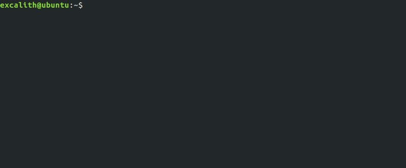

	<h1 align="center">Git Observer - <i>A Developer Companion</i></h1>

    A simple tool that saves developers time to launch issues, commits and PRs right from terminal

    

	
	
	
	

**Git Observer** is a simple terminal application where you can launch project related pages right from your terminal. It allows you to save and switch projects from your terminal allowing you to launch corresponding pages directly.

## How To Install:

- Requirements
  - [NodeJS](https://nodejs.org)
  - [NPM](https://www.npmjs.com/get-npm)
- Clone or Download this repository
- Within the directory, from your favorite terminal
  - `npm install`
  - `npm link` (might ask for permission depending on your OS)
- Now you can use `git-observer` or `gob` right from your terminal!

## How To Use:
In order to use the app, please follow **How To Install** steps above.

When you complete installation, you can run the app by typing `gob` or `git-observer`. On your first run, app will ask you to create settings for your project.

| _Settings_                    | _Description_                                                                       |
| ----------------------------- | ----------------------------------------------------------------------------------- |
| Project Name (string)         | Your project name                                                                   |
| Project Commits (link)        | Link to your commits (ie. `https://github.com/excalith/Git-Observer/commit/` )      |
| Project Issues (link)         | Link to your issues (ie. `https://github.com/excalith/Git-Observer/issues/` )       |
| Project Pull-Requests (link)  | Link to your pull-requests (ie. `https://github.com/excalith/Git-Observer/pull/` )  |

Whenever you create a project, app sets it as default project. You can then run commands to launch corresponding page from terminal. Please check **Available Commands** for more.

## Available Commands:

| _Command_                     | _Description_                               |
| ----------------------------- | ------------------------------------------- |
| gob                           | Add new project on first run or show help   |
| gob -a --add                  | Add a new project                           |
| gob -g --get                  | Get all projects                            |
| gob -d --delete               | Delete a project from settings              |
| gob -i --issue [Number]       | Check issue on browser                      |
| gob -c --commit [Hash]        | Check commit on browser                     |
| gob -p --pull [Number]        | Check pull request on browser               |
| gob -h --help                 | Show help                                   |

## License
This project is licensed under the MIT License - see the [LICENSE.md](LICENSE.md) file for details.
